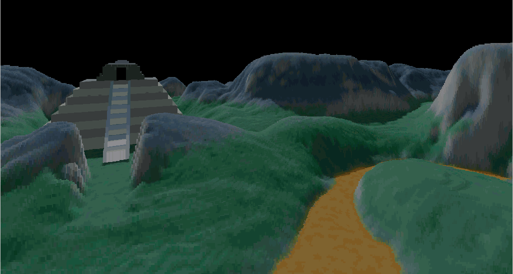

# Mountain

A simple implementation of the voxel engine used in the [comanche vide games](https://en.wikipedia.org/wiki/Comanche_(video_game_series) (also called VoxelSpace).

This was heavily inspired by [s-make's github project VoxelSpace](https://github.com/s-macke/VoxelSpace).

The difference is that the target is a small arm9 portable game console called the [pocketGo](https://www.bittboy.com/collections/pocketgo/products/pocketgo-retro-handheld), seriously underpowered. And the language is rust.

See the [docker image](https://github.com/Blizarre/pocketgo-docker-rust) with the arm9 toolchain and a modern version of rust that i use to build the sources.

Benchmark for the version as of this commit (1024x1024 texture and height map, 320x240 screen):
- i7 laptop: 42.4ms / draw debug, 7.30ms /  draw release
- pocketGo: 145ms / draw release

The texture is way to large for the pocketGo, but the goal is to push it to its limits.

Todo:
- Use a smaller scale image for the heightmap
- improve performance